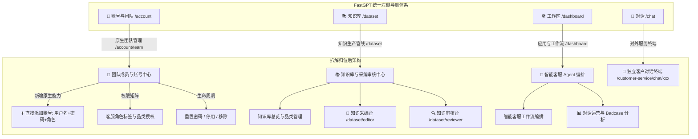

# FastGPT 智能客服模块全量拆解与原生化架构开发设计文档

## 📌 一、 需求背景与痛点诊断

### 1.1 现状与痛点分析
当前系统中存在严重的“**烟囱式外挂系统**”与“**多层深层嵌套**”问题：
1. **层级极深、入口隐蔽**：
   - 所有的业务功能被一股脑塞进了 `/customer-service` 这个二级子路由下。
   - 内部又分化出了 `/customer-service/console`（大厅）、`/customer-service/admin`（5 个 Tab 的控制台）、`/customer-service/roles`（岗位中心）、`/customer-service/editor`（采编台）、`/customer-service/reviewer`（审核台）。
   - 管理员登录后，想找一个简单的“创建账号”功能，在全局导航、控制台、大厅里层层翻找都找不到入口，心智模型极度混乱。
2. **重复造轮子与功能割裂**：
   - FastGPT 本身拥有成熟的 **账号体系（Account / Team）**、**工作区（Dashboard / Studio）**、**知识库（Dataset）** 底座。
   - 但客服模块却自己造了一套孤立的人员管理（`/customer-service/roles`）、孤立的项目编排（`AssistantsWorkspace`）、孤立的知识总库（`KnowledgeStudio`），导致用户在一个系统里感受到了两个截然不同的软件，体验支离破碎。
3. **页面臃肿杂乱**：
   - 控制台单页承载过多异构业务（项目编排、知识表单、品类管理、模型密钥、Badcase 聚类、人员权限），缺乏清晰的主干动线。

---

## 🎯 二、 核心重构目标与设计原则

1. **消除孤岛，功能全面拆解归位（Native First）**：
   - 不再搞独立的 `/customer-service` 嵌套小宇宙，把所有功能拆散，按业务职责精准归入 FastGPT 原生的四大根目录：**【账号/团队】**、**【工作区/应用】**、**【知识库】**、**【对话终端】**。
2. **极简扁平，一键直达**：
   - 杜绝 3 层以上的页面嵌套。管理员想建号，在「团队管理」1 键建号；采编员想写知识，在「知识库」1 键打开采编；审核员想审知识，在「知识库」1 键进入审核流。
3. **保持 FastGPT 设计规范与 UI 一致性**：
   - 严格遵循 ChakraUI + FastGPT 全局设计规范，剔除浮夸杂乱的装饰 Banner，保证工业级后台的简洁、高效与优雅。

---

## 🏗️ 三、 模块拆解与根页面对齐架构

---

## 📋 四、 详细拆解方案与页面映射表

| 原客服模块功能 (废弃/拆解) | 重构后归位根页面 | 页面路径 | 角色可见性 | 核心交互与能力 |
| :--- | :--- | :--- | :--- | :--- |
| **新建账号 / 岗位中心** (`/customer-service/roles`) | **FastGPT 团队成员管理** | `/account/team` | 管理员 (Owner/Manager) | • 原生直接添加成员（用户名+密码+角色） • 统一维护客服角色标签（采编/审核/管理员）与品类授权 • 一键重置密码与停启用 |
| **知识采编台** (`/customer-service/editor`) | **知识库 -> 知识采编** | `/dataset/editor` | 采编员 / 管理员 | • 4 大结构化录入模板（FAQ、故障诊断树、产品主数据、设备手册） • 草稿箱管理与一键提审 |
| **知识审核台** (`/customer-service/reviewer`) | **知识库 -> 知识审核** | `/dataset/reviewer` | 审核员 / 管理员 | • 待审知识列表与双人复核 • 语义 Diff 对比与在线试问沙箱 • 驳回填写原因与一键发布生效 |
| **客服项目与编排** (`/customer-service/admin?tab=projects`) | **工作区 -> 智能客服应用** | `/dashboard/agent` & `/app/detail` | 管理员 | • 原生 FastGPT 工作流编排（意图识别、RAG、设备指令） • 一键发布对外独立 Chat 链接 |
| **Badcase 聚类与运营** (`/customer-service/admin?tab=operations`) | **工作区 -> 运营分析** | `/dashboard/agent` 或 `/dataset/operations` | 管理员 | • 未命中聚类分析、Badcase 一键转采编草稿 |
| **外部独立服务窗口** (`/customer-service/chat/[projectCode]`) | **独立对话终端** | `/customer-service/chat/[projectCode]` | 终端用户 / 访客 | • 极简、高质感无人设备专属智能对话窗口（支持排查卡片） |

---

## 🛠️ 五、 实施计划与步骤 (TODO List)

- [x] **Step 1: 原生团队管理 (`/account/team`) 改造**
  - 在 [`MemberTable.tsx`](file:///root/FastGPT-source/projects/app/src/pageComponents/account/team/MemberTable.tsx) 中增加「直接添加成员」按钮及专属弹窗 [`DirectAddMemberModal.tsx`](file:///root/FastGPT-source/projects/app/src/pageComponents/account/team/DirectAddMemberModal.tsx)。
  - 支持管理员一键录入：用户名、姓名、初始密码、团队角色、客服岗位。
  - 在成员列表中直观展示成员角色与客服岗位 Tag，支持一键创建并立即生效。
- [x] **Step 2: 知识采编与审核流拆入知识库 (`/dataset`) 根体系**
  - 创建 [`/dataset/editor`](file:///root/FastGPT-source/projects/app/src/pages/dataset/editor/index.tsx)（知识采编台）与 [`/dataset/reviewer`](file:///root/FastGPT-source/projects/app/src/pages/dataset/reviewer/index.tsx)（知识审核台）路由。
  - 在知识库总览（[`/dataset/list`](file:///root/FastGPT-source/projects/app/src/pages/dataset/list/index.tsx)）顶部增加快捷直达按钮：`[📝 知识采编台 | 🔍 知识审核台]`，采编员/审核员一键直达。
  - 在 [`CustomerServiceHeader.tsx`](file:///root/FastGPT-source/projects/app/src/pageComponents/customerService/CustomerServiceHeader.tsx) 中将所有导航链接对齐到 `/dataset/list`、`/dataset/editor`、`/dataset/reviewer` 和 `/account/team`。
- [x] **Step 3: 全局侧边栏清理与孤岛路由瘦身**
  - 在 [`navbar.tsx`](file:///root/FastGPT-source/projects/app/src/components/Layout/navbar.tsx) 与 [`navbarPhone.tsx`](file:///root/FastGPT-source/projects/app/src/components/Layout/navbarPhone.tsx) 中移除冗余的 `customer_service` 侧边栏按钮，恢复清爽的原生 4 导航结构（Chat、Studio、Datasets、Account）。
  - 将 `/customer-service/roles` 重定向至 `/account/team`，将 `/customer-service/console` 重定向至 `/dataset/list`，保证向前兼容。
- [x] **Step 4: 自动化测试与全链路回归验证**
  - 运行单元测试 `createMember.test.ts` 全部通过。
